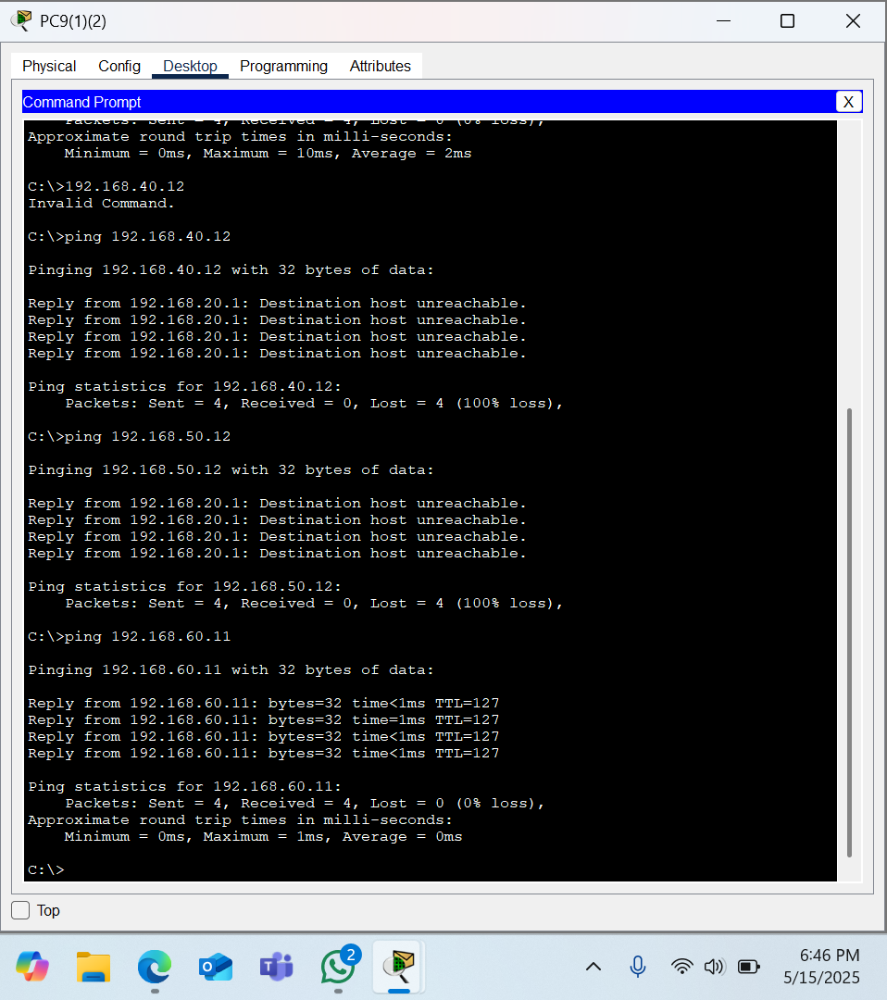
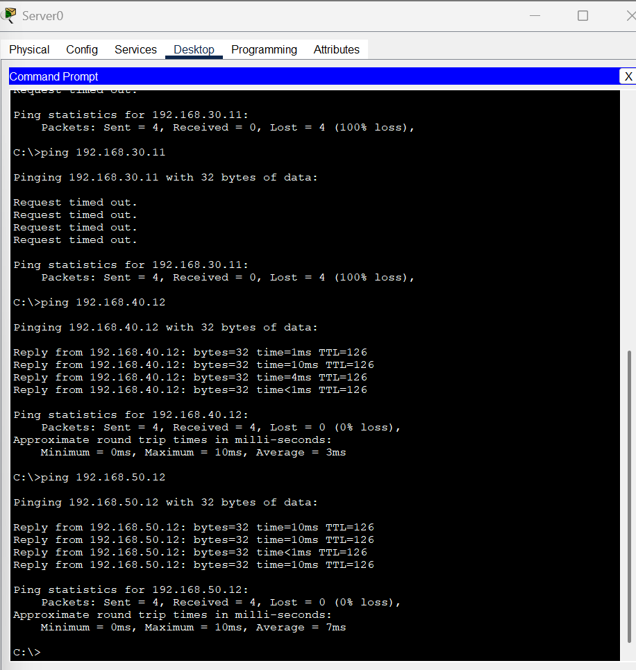

# 🗓️[ Implementasi Keamanan & Pengujian] - [Pekan 14]

##  💡Anggota Kelompok dan Peran
- Muhammad Novri Aziztra (10231066) - Network Architect
- Zahwa Hanna Dwi Putri (10231092) - Network Engineer
- Indah Nur Fortuna (10231044) - Network Services Spesiaclist
- Putri Rahmawati (10231074) - Security & Documentation Specialist
---

## Tujuan
Implementasi jaringan perusahaan ini bertujuan membangun infrastruktur yang aman, handal, dan efisien. Sistem keamanan diperkuat melalui penerapan Access Control List (ACL) untuk mengatur akses antar departemen, isolasi data sensitif menggunakan VLAN, serta pencegahan akses tidak sah ke informasi finansial dan karyawan. Redundansi dan ketersediaan tinggi (high availability) dijamin dengan menyediakan infrastruktur backup dan mekanisme failover otomatis bagi layanan kritis, memastikan operasional tetap berjalan saat terjadi gangguan. Segmentasi jaringan diterapkan untuk memisahkan lalu lintas antar departemen, mengurangi broadcast domain, serta memudahkan pengelolaan dan troubleshooting jaringan.

Manajemen akses dilakukan secara ketat untuk memastikan setiap departemen hanya dapat mengakses data sesuai kebutuhan dan kebijakan keamanan yang berlaku. Infrastruktur dirancang mendukung skalabilitas, sehingga memungkinkan penambahan departemen, perangkat, dan pengguna dengan mudah seiring perkembangan perusahaan. Proses monitoring dan maintenance difasilitasi dengan sistem pemantauan performa real-time dan pemeliharaan terjadwal tanpa mengganggu operasional. Selain itu, optimasi performa dilakukan dengan mengurangi latensi, meningkatkan efisiensi penggunaan bandwidth, dan memperbaiki kinerja jaringan secara keseluruhan. Seluruh implementasi ini dilengkapi dengan dokumentasi komprehensif untuk mendukung transfer pengetahuan, mempercepat troubleshooting, dan menjamin kelangsungan operasional jaringan di masa mendatang.

## 1. 🔗[Link File Simulasi Topologi Cisco Packet Tracer](https://drive.google.com/file/d/1gKV2bJEgTcooDECFVJOqyvwLDy0k6EYF/view?usp=drive_link)

## 2. Dokumentasi Konfigurasi ACL

Konfigurasi ACL GEDUNG A (Router A)
```
Router> enable
Router# configure terminal

! -----------------------------
! ACL 101 - Departemen Keuangan
! -----------------------------
access-list 101 deny ip 192.168.20.0 0.0.0.255 192.168.40.0 0.0.0.255     ! Blokir ke Marketing
access-list 101 deny ip 192.168.20.0 0.0.0.255 192.168.50.0 0.0.0.255     ! Blokir ke Operasional
access-list 101 permit ip 192.168.20.0 0.0.0.255 192.168.30.0 0.0.0.255   ! Boleh ke SDM
access-list 101 permit ip 192.168.20.0 0.0.0.255 192.168.60.0 0.0.0.255   ! Boleh ke Server Farm
access-list 101 permit ip any any

! ------------------------
! ACL 102 - Departemen SDM
! ------------------------
access-list 102 deny ip 192.168.30.0 0.0.0.255 192.168.60.0 0.0.0.255          ! Blokir ke semua Server
access-list 102 permit ip 192.168.30.0 0.0.0.255 host 192.168.60.20            ! Kecuali ke server SDM
access-list 102 permit ip 192.168.30.0 0.0.0.255 192.168.10.0 0.0.0.255        ! Ke IT
access-list 102 permit ip 192.168.30.0 0.0.0.255 192.168.20.0 0.0.0.255        ! Ke Keuangan
access-list 102 permit ip 192.168.30.0 0.0.0.255 192.168.40.0 0.0.0.255        ! Ke Marketing
access-list 102 permit ip 192.168.30.0 0.0.0.255 192.168.50.0 0.0.0.255        ! Ke Operasional
access-list 102 permit ip any any

! -------------------------
! Terapkan ACL di Router A
! -------------------------
interface GigabitEthernet0/0.20
 ip access-group 101 in
exit

interface GigabitEthernet0/0.30
 ip access-group 102 in
exit

end
write memory
```

Konfigurasi ACL GEDUNG B (Router B)
```
Router> enable
Router# configure terminal

! -----------------------------------------------
! ACL 103 - Departemen Marketing & Operasional
! -----------------------------------------------
access-list 103 deny ip 192.168.40.0 0.0.0.255 192.168.20.0 0.0.0.255     ! Marketing ke Keuangan
access-list 103 deny ip 192.168.50.0 0.0.0.255 192.168.20.0 0.0.0.255     ! Operasional ke Keuangan
access-list 103 permit ip 192.168.40.0 0.0.0.255 192.168.60.0 0.0.0.255   ! Marketing ke Server Farm
access-list 103 permit ip 192.168.50.0 0.0.0.255 192.168.60.0 0.0.0.255   ! Operasional ke Server Farm
access-list 103 permit ip any any

! -------------------------
! Terapkan ACL di Router B
! -------------------------
interface GigabitEthernet0/1.40
 ip access-group 103 in
exit

interface GigabitEthernet0/1.50
 ip access-group 103 in
exit

end
write memory
```

Konfigurasi ACL di CLI Router A

Pada gambar Router A terlihat konfigurasi router utama jaringan perusahaan. Kode konfigurasi kemungkinan mencakup implementasi routing protokol seperti OSPF atau EIGRP untuk routing dinamis, konfigurasi NAT/PAT untuk translasi alamat jaringan, dan implementasi kebijakan QoS untuk klasifikasi dan prioritisasi lalu lintas. Tujuannya adalah menyediakan routing efisien dan aman antar segmen jaringan perusahaan. Hasilnya adalah konektivitas mulus antar departemen dengan latensi minimal, traffic management yang optimal untuk berbagai jenis aplikasi, dan kemampuan untuk menyesuaikan secara dinamis dengan perubahan topologi jaringan.

Konfigurasi ACL di CLI Router B

Pada gambar Router B terlihat konfigurasi router sekunder atau backup. Kode konfigurasi mungkin mencakup implementasi HSRP (Hot Standby Router Protocol) atau GLBP (Gateway Load Balancing Protocol) untuk redundansi gateway, konfigurasi BGP untuk koneksi multi-homing ke penyedia internet, dan implementasi IPv6 dual-stack untuk transisi jaringan yang mulus. Tujuannya adalah memastikan ketersediaan konektivitas internet yang konstan dan distribusi beban yang optimal. Hasilnya adalah infrastruktur routing yang tangguh dan skalabel dengan kemampuan untuk menangani kegagalan perangkat tanpa gangguan layanan, manajemen bandwidth yang efisien, dan persiapan untuk adopsi teknologi networking masa depan.

## 3. Matriks Pengujian ACL

###  *Hasil Pengujian ACL Berdasarkan IP*

#### *Sumber: Departemen IT – 192.168.10.14*

| No | Tujuan                      | Hasil Ping                 | Keterangan                |
| -- | --------------------------- | -------------------------- | ------------------------- |
| 1  | Keuangan (192.168.20.15)    | Reply from 192.168.20.15 | ✅ Diizinkan (akses penuh) |
| 2  | SDM (192.168.30.11)         | Reply from 192.168.30.11 | ✅ Diizinkan               |
| 3  | Marketing (192.168.40.12)   | Reply from 192.168.40.12 | ✅ Diizinkan               |
| 4  | Operasional (192.168.50.12) | Reply from 192.168.50.12 | ✅ Diizinkan               |
| 5  | Server Farm (192.168.60.11) | Reply from 192.168.60.11 | ✅ Diizinkan               |

---

#### *Sumber: Departemen Keuangan – 192.168.20.15*

| No | Tujuan                      | Hasil Ping                 | Keterangan              |
| -- | --------------------------- | -------------------------- | ----------------------- |
| 1  | IT (192.168.10.14)          | Reply from 192.168.10.14 | ✅ Diizinkan             |
| 2  | SDM (192.168.30.11)         | Reply from 192.168.30.11 | ✅ Diizinkan             |
| 3  | Marketing (192.168.40.12)   | Destination host unreachable        | ❌ Diblokir oleh ACL 101 |
| 4  | Operasional (192.168.50.12) | Destination host unreachable        | ❌ Diblokir oleh ACL 101 |
| 5  | Server Farm (192.168.60.11) | Reply from 192.168.60.11 | ✅ Diizinkan             |

---

#### *Sumber: Departemen SDM – 192.168.30.11*

| No | Tujuan                      | Hasil Ping                     | Keterangan                 |
| -- | --------------------------- | ------------------------------ | -------------------------- |
| 1  | IT (192.168.10.14)          | Reply from 192.168.10.14     | ✅ Diizinkan                |
| 2  | Keuangan (192.168.20.15)    | Reply from 192.168.20.15     | ✅ Diizinkan                |
| 3  | Marketing (192.168.40.12)   | Reply from 192.168.40.12     | ✅ Diizinkan                |
| 4  | Operasional (192.168.50.12) | Reply from 192.168.50.12     | ✅ Diizinkan                |
| 5  | Server Farm (192.168.60.11) | Destination host unreachable | ❌ Diblokir (kecuali 60.20) |

---

#### *Sumber: Departemen Marketing – 192.168.40.12*

| No | Tujuan                      | Hasil Ping                 | Keterangan              |
| -- | --------------------------- | -------------------------- | ----------------------- |
| 1  | IT (192.168.10.14)          | Reply from 192.168.10.14 | ✅ Diizinkan             |
| 2  | Keuangan (192.168.20.15)    | Destination host unreachable        | ❌ Diblokir oleh ACL 103 |
| 3  | SDM (192.168.30.11)         | Reply from 192.168.30.11 | ✅ Diizinkan             |
| 4  | Operasional (192.168.50.12) | Reply from 192.168.50.12 | ✅ Diizinkan             |
| 5  | Server Farm (192.168.60.11) | Reply from 192.168.60.11 | ✅ Diizinkan             |

---

#### *Sumber: Departemen Operasional – 192.168.50.12*

| No | Tujuan                      | Hasil Ping                 | Keterangan              |
| -- | --------------------------- | -------------------------- | ----------------------- |
| 1  | IT (192.168.10.14)          | Reply from 192.168.10.14 | ✅ Diizinkan             |
| 2  | Keuangan (192.168.20.15)    | Destination host unreachable        | ❌ Diblokir oleh ACL 103 |
| 3  | SDM (192.168.30.11)         | Reply from 192.168.30.11 | ✅ Diizinkan             |
| 4  | Marketing (192.168.40.12)   | Reply from 192.168.40.12 | ✅ Diizinkan             |
| 5  | Server Farm (192.168.60.11) | Reply from 192.168.60.11 | ✅ Diizinkan             |

---

#### *Sumber: Server Farm – 192.168.60.11*

| No | Tujuan                      | Hasil Ping                 | Keterangan                      |
| -- | --------------------------- | -------------------------- | ------------------------------- |
| 1  | IT (192.168.10.14)          | Reply from 192.168.10.14 | ✅ Bisa (umumnya akses 2 arah)   |
| 2  | Keuangan (192.168.20.15)    | Reply from 192.168.20.15 | ✅ Bisa                          |
| 3  | SDM (192.168.30.11)         | Reply from 192.168.30.11 | ✅ Bisa (ping masuk dari server) |
| 4  | Marketing (192.168.40.12)   | Reply from 192.168.40.12 | ✅ Bisa                          |
| 5  | Operasional (192.168.50.12) | Reply from 192.168.50.12 | ✅ Bisa                          |

---

Uji Konektivitas Departemen IT A

Pada gambar Departemen IT A terlihat topologi jaringan untuk divisi teknologi informasi. Struktur jaringan terdiri dari beberapa workstation yang terhubung ke switch utama, dengan server yang menjalankan aplikasi penting perusahaan. Kode konfigurasi pada topologi ini kemungkinan menggunakan VLAN tagging (802.1Q) untuk mengisolasi lalu lintas data IT dari departemen lain, dengan implementasi ACL (Access Control List) untuk membatasi akses ke server sensitif. Tujuan dari konfigurasi ini adalah untuk memastikan departemen IT memiliki infrastruktur yang aman dan terisolasi untuk mengelola sistem perusahaan. Hasilnya adalah jaringan departemen IT yang terlindungi dengan baik dan mampu melakukan administrasi sistem tanpa gangguan dari departemen lain, sekaligus mempertahankan visibilitas penuh terhadap seluruh jaringan perusahaan.

Uji Konektivitas Departemen Marketing

Pada gambar Marketing A terlihat topologi jaringan untuk departemen marketing. Struktur jaringan terdiri dari beberapa workstation yang terhubung ke switch utama, dengan printer dan perangkat multimedia untuk kebutuhan marketing. Kode konfigurasi pada topologi ini menggunakan VLAN tagging untuk mengisolasi lalu lintas data marketing, dengan implementasi ACL yang membatasi akses ke departemen keuangan namun mengizinkan akses ke server farm. Tujuan dari konfigurasi ini adalah untuk memastikan departemen marketing memiliki akses yang diperlukan ke sumber daya perusahaan sambil mempertahankan keamanan data sensitif. Hasilnya adalah jaringan marketing yang efisien dengan akses terkontrol ke sumber daya yang diperlukan untuk operasi sehari-hari.

Uji Konektivitas Departemen Operasional

Pada gambar Operasional A terlihat topologi jaringan untuk departemen operasional. Struktur jaringan terdiri dari workstation yang terhubung ke switch utama, dengan perangkat IoT dan sistem monitoring operasional. Kode konfigurasi pada topologi ini menggunakan VLAN tagging untuk mengisolasi lalu lintas data operasional, dengan implementasi ACL yang membatasi akses ke departemen keuangan namun mengizinkan akses ke server farm. Tujuan dari konfigurasi ini adalah untuk memastikan departemen operasional memiliki akses yang diperlukan ke sistem monitoring dan kontrol sambil mempertahankan keamanan jaringan. Hasilnya adalah jaringan operasional yang stabil dengan kemampuan monitoring real-time dan akses terkontrol ke sistem yang diperlukan.

Uji Konektivitas Server Farm

Pada gambar Server A terlihat topologi jaringan untuk server farm perusahaan. Struktur jaringan terdiri dari beberapa server yang terhubung ke switch utama, dengan sistem storage dan backup. Kode konfigurasi pada topologi ini menggunakan VLAN tagging untuk mengisolasi lalu lintas data server, dengan implementasi ACL yang mengatur akses dari berbagai departemen. Tujuan dari konfigurasi ini adalah untuk memastikan server farm memiliki keamanan tinggi dan akses terkontrol dari departemen-departemen yang membutuhkan. Hasilnya adalah infrastruktur server yang aman dengan akses yang diatur berdasarkan kebutuhan masing-masing departemen.

Uji Konektivitas Departemen IT B

Pada gambar Departemen IT B terlihat topologi jaringan backup untuk divisi teknologi informasi. Struktur jaringan terdiri dari workstation dan server backup yang terhubung ke switch utama. Kode konfigurasi pada topologi ini menggunakan VLAN tagging untuk redundansi dan failover, dengan implementasi ACL yang mencerminkan kebijakan keamanan departemen IT A. Tujuan dari konfigurasi ini adalah untuk menyediakan infrastruktur cadangan yang aman dan terisolasi untuk departemen IT. Hasilnya adalah sistem backup yang terlindungi dengan baik dan mampu mengambil alih operasi jika terjadi kegagalan pada sistem utama.

Uji Konektivitas Departemen Keuangan A

Pada gambar Departemen Keuangan A terlihat topologi jaringan untuk divisi keuangan. Struktur jaringan terdiri dari workstation yang terhubung ke switch utama, dengan printer dan perangkat keamanan khusus. Kode konfigurasi pada topologi ini menggunakan VLAN tagging untuk mengisolasi lalu lintas data keuangan, dengan implementasi ACL yang membatasi akses ke departemen marketing dan operasional. Tujuan dari konfigurasi ini adalah untuk memastikan departemen keuangan memiliki infrastruktur yang aman dan terisolasi untuk mengelola data finansial perusahaan. Hasilnya adalah jaringan keuangan yang terlindungi dengan baik dan mampu melakukan transaksi finansial dengan tingkat keamanan tinggi.

Uji Konektivitas Departemen Keuangan B

Pada gambar Departemen Keuangan B terlihat topologi jaringan backup untuk divisi keuangan. Struktur jaringan terdiri dari workstation dan sistem backup yang terhubung ke switch utama. Kode konfigurasi pada topologi ini menggunakan VLAN tagging untuk redundansi, dengan implementasi ACL yang mencerminkan kebijakan keamanan departemen Keuangan A. Tujuan dari konfigurasi ini adalah untuk menyediakan infrastruktur cadangan yang aman untuk departemen keuangan. Hasilnya adalah sistem backup yang terlindungi dengan baik dan mampu mengambil alih operasi jika terjadi kegagalan pada sistem utama.

Uji Konektivitas Departemen SDM A

Pada gambar Departemen SDM A terlihat topologi jaringan untuk divisi sumber daya manusia. Struktur jaringan terdiri dari workstation yang terhubung ke switch utama, dengan printer dan sistem manajemen SDM. Kode konfigurasi pada topologi ini menggunakan VLAN tagging untuk mengisolasi lalu lintas data SDM, dengan implementasi ACL yang membatasi akses ke server farm kecuali host tertentu. Tujuan dari konfigurasi ini adalah untuk memastikan departemen SDM memiliki akses yang diperlukan ke sistem manajemen karyawan sambil mempertahankan keamanan data. Hasilnya adalah jaringan SDM yang efisien dengan akses terkontrol ke sistem yang diperlukan.

Uji Konektivitas Departemen SDM B

Pada gambar Departemen SDM B terlihat topologi jaringan backup untuk divisi sumber daya manusia. Struktur jaringan terdiri dari workstation dan sistem backup yang terhubung ke switch utama. Kode konfigurasi pada topologi ini menggunakan VLAN tagging untuk redundansi, dengan implementasi ACL yang mencerminkan kebijakan keamanan departemen SDM A. Tujuan dari konfigurasi ini adalah untuk menyediakan infrastruktur cadangan yang aman untuk departemen SDM. Hasilnya adalah sistem backup yang terlindungi dengan baik dan mampu mengambil alih operasi jika terjadi kegagalan pada sistem utama.

Uji Konektivitas Departemen Marketing B

Pada gambar Marketing B terlihat topologi jaringan backup untuk departemen marketing. Struktur jaringan terdiri dari workstation dan sistem backup yang terhubung ke switch utama. Kode konfigurasi pada topologi ini menggunakan VLAN tagging untuk redundansi, dengan implementasi ACL yang mencerminkan kebijakan keamanan departemen Marketing A. Tujuan dari konfigurasi ini adalah untuk menyediakan infrastruktur cadangan yang aman untuk departemen marketing. Hasilnya adalah sistem backup yang terlindungi dengan baik dan mampu mengambil alih operasi jika terjadi kegagalan pada sistem utama.

Uji Konektivitas Departemen Operasional B

Pada gambar Operasional B terlihat topologi jaringan backup untuk departemen operasional. Struktur jaringan terdiri dari workstation dan sistem monitoring backup yang terhubung ke switch utama. Kode konfigurasi pada topologi ini menggunakan VLAN tagging untuk redundansi, dengan implementasi ACL yang mencerminkan kebijakan keamanan departemen Operasional A. Tujuan dari konfigurasi ini adalah untuk menyediakan infrastruktur cadangan yang aman untuk departemen operasional. Hasilnya adalah sistem backup yang terlindungi dengan baik dan mampu mengambil alih operasi monitoring jika terjadi kegagalan pada sistem utama.

Uji Konektivitas Server Farm B

Pada gambar Server B terlihat topologi jaringan backup untuk server farm perusahaan. Struktur jaringan terdiri dari server backup dan sistem storage yang terhubung ke switch utama. Kode konfigurasi pada topologi ini menggunakan VLAN tagging untuk redundansi, dengan implementasi ACL yang mencerminkan kebijakan keamanan Server Farm A. Tujuan dari konfigurasi ini adalah untuk menyediakan infrastruktur server cadangan yang aman dan terisolasi. Hasilnya adalah sistem backup server yang terlindungi dengan baik dan mampu mengambil alih operasi jika terjadi kegagalan pada server utama.

Uji Konektivitas Departemen IT A (Detail)

Pada gambar Departemen IT A terlihat detail konfigurasi jaringan untuk divisi teknologi informasi. Struktur jaringan terdiri dari workstation administrator, server development, dan perangkat testing yang terhubung ke switch utama. Kode konfigurasi pada topologi ini menggunakan VLAN tagging untuk segmentasi jaringan internal IT, dengan implementasi ACL yang mengatur akses ke server development dan testing. Tujuan dari konfigurasi ini adalah untuk memastikan departemen IT memiliki lingkungan development dan testing yang aman dan terisolasi. Hasilnya adalah infrastruktur IT yang memungkinkan pengembangan dan pengujian aplikasi dengan tingkat keamanan tinggi.

Uji Konektivitas Departemen IT B (Detail)

Pada gambar Departemen IT B terlihat detail konfigurasi jaringan backup untuk divisi teknologi informasi. Struktur jaringan terdiri dari workstation backup, server staging, dan perangkat monitoring yang terhubung ke switch utama. Kode konfigurasi pada topologi ini menggunakan VLAN tagging untuk redundansi dan failover, dengan implementasi ACL yang mengatur akses ke server staging dan monitoring. Tujuan dari konfigurasi ini adalah untuk menyediakan infrastruktur cadangan yang aman untuk pengembangan dan pengujian aplikasi. Hasilnya adalah sistem backup yang memungkinkan kelanjutan operasi development dan testing jika terjadi kegagalan pada sistem utama.

Uji Konektivitas Departemen Keuangan A (Detail)

Pada gambar Departemen Keuangan A terlihat detail konfigurasi jaringan untuk divisi keuangan. Struktur jaringan terdiri dari workstation akuntansi, server database keuangan, dan printer khusus yang terhubung ke switch utama. Kode konfigurasi pada topologi ini menggunakan VLAN tagging untuk mengisolasi lalu lintas data keuangan, dengan implementasi ACL yang membatasi akses ke database keuangan. Tujuan dari konfigurasi ini adalah untuk memastikan departemen keuangan memiliki akses yang aman ke data finansial perusahaan. Hasilnya adalah jaringan keuangan yang terlindungi dengan baik untuk operasi akuntansi dan keuangan.

Uji Konektivitas Departemen Keuangan B (Detail)

Pada gambar Departemen Keuangan B terlihat detail konfigurasi jaringan backup untuk divisi keuangan. Struktur jaringan terdiri dari workstation backup, server database cadangan, dan printer backup yang terhubung ke switch utama. Kode konfigurasi pada topologi ini menggunakan VLAN tagging untuk redundansi, dengan implementasi ACL yang mengatur akses ke database cadangan. Tujuan dari konfigurasi ini adalah untuk menyediakan infrastruktur cadangan yang aman untuk operasi keuangan. Hasilnya adalah sistem backup yang memungkinkan kelanjutan operasi keuangan jika terjadi kegagalan pada sistem utama.

Uji Konektivitas Departemen SDM A (Detail)

Pada gambar Departemen SDM A terlihat detail konfigurasi jaringan untuk divisi sumber daya manusia. Struktur jaringan terdiri dari workstation HR, server database karyawan, dan sistem absensi yang terhubung ke switch utama. Kode konfigurasi pada topologi ini menggunakan VLAN tagging untuk mengisolasi lalu lintas data SDM, dengan implementasi ACL yang mengatur akses ke database karyawan. Tujuan dari konfigurasi ini adalah untuk memastikan departemen SDM memiliki akses yang aman ke data karyawan. Hasilnya adalah jaringan SDM yang terlindungi dengan baik untuk operasi manajemen karyawan.

Uji Konektivitas Departemen SDM B (Detail)

Pada gambar Departemen SDM B terlihat detail konfigurasi jaringan backup untuk divisi sumber daya manusia. Struktur jaringan terdiri dari workstation backup, server database cadangan, dan sistem absensi backup yang terhubung ke switch utama. Kode konfigurasi pada topologi ini menggunakan VLAN tagging untuk redundansi, dengan implementasi ACL yang mengatur akses ke database cadangan. Tujuan dari konfigurasi ini adalah untuk menyediakan infrastruktur cadangan yang aman untuk operasi SDM. Hasilnya adalah sistem backup yang memungkinkan kelanjutan operasi manajemen karyawan jika terjadi kegagalan pada sistem utama.

Uji Konektivitas Departemen Marketing A (Detail)

Pada gambar Marketing A terlihat detail konfigurasi jaringan untuk departemen marketing. Struktur jaringan terdiri dari workstation marketing, server konten, dan perangkat multimedia yang terhubung ke switch utama. Kode konfigurasi pada topologi ini menggunakan VLAN tagging untuk mengisolasi lalu lintas data marketing, dengan implementasi ACL yang mengatur akses ke server konten. Tujuan dari konfigurasi ini adalah untuk memastikan departemen marketing memiliki akses yang aman ke aset digital dan konten marketing. Hasilnya adalah jaringan marketing yang terlindungi dengan baik untuk operasi pemasaran digital.

Uji Konektivitas Departemen Marketing B (Detail)

Pada gambar Marketing B terlihat detail konfigurasi jaringan backup untuk departemen marketing. Struktur jaringan terdiri dari workstation backup, server konten cadangan, dan perangkat multimedia backup yang terhubung ke switch utama. Kode konfigurasi pada topologi ini menggunakan VLAN tagging untuk redundansi, dengan implementasi ACL yang mengatur akses ke server konten cadangan. Tujuan dari konfigurasi ini adalah untuk menyediakan infrastruktur cadangan yang aman untuk operasi marketing. Hasilnya adalah sistem backup yang memungkinkan kelanjutan operasi pemasaran digital jika terjadi kegagalan pada sistem utama.

Uji Konektivitas Departemen Operasional A (Detail)

Pada gambar Operasional A terlihat detail konfigurasi jaringan untuk departemen operasional. Struktur jaringan terdiri dari workstation operasional, server monitoring, dan perangkat IoT yang terhubung ke switch utama. Kode konfigurasi pada topologi ini menggunakan VLAN tagging untuk mengisolasi lalu lintas data operasional, dengan implementasi ACL yang mengatur akses ke server monitoring. Tujuan dari konfigurasi ini adalah untuk memastikan departemen operasional memiliki akses yang aman ke sistem monitoring dan kontrol. Hasilnya adalah jaringan operasional yang terlindungi dengan baik untuk operasi monitoring dan kontrol.

Uji Konektivitas Departemen Operasional B (Detail)

Pada gambar Operasional B terlihat detail konfigurasi jaringan backup untuk departemen operasional. Struktur jaringan terdiri dari workstation backup, server monitoring cadangan, dan perangkat IoT backup yang terhubung ke switch utama. Kode konfigurasi pada topologi ini menggunakan VLAN tagging untuk redundansi, dengan implementasi ACL yang mengatur akses ke server monitoring cadangan. Tujuan dari konfigurasi ini adalah untuk menyediakan infrastruktur cadangan yang aman untuk operasi monitoring dan kontrol. Hasilnya adalah sistem backup yang memungkinkan kelanjutan operasi monitoring dan kontrol jika terjadi kegagalan pada sistem utama.

Uji Konektivitas Server Farm A (Detail)

Pada gambar Server A terlihat detail konfigurasi jaringan untuk server farm perusahaan. Struktur jaringan terdiri dari server aplikasi, server database, dan sistem storage yang terhubung ke switch utama. Kode konfigurasi pada topologi ini menggunakan VLAN tagging untuk mengisolasi lalu lintas data server, dengan implementasi ACL yang mengatur akses ke berbagai server. Tujuan dari konfigurasi ini adalah untuk memastikan server farm memiliki keamanan tinggi dan akses terkontrol. Hasilnya adalah infrastruktur server yang aman dengan segmentasi yang jelas antar layanan.

Uji Konektivitas Server Farm B (Detail)

Pada gambar Server B terlihat detail konfigurasi jaringan backup untuk server farm perusahaan. Struktur jaringan terdiri dari server aplikasi cadangan, server database cadangan, dan sistem storage cadangan yang terhubung ke switch utama. Kode konfigurasi pada topologi ini menggunakan VLAN tagging untuk redundansi, dengan implementasi ACL yang mengatur akses ke server cadangan. Tujuan dari konfigurasi ini adalah untuk menyediakan infrastruktur server cadangan yang aman dan terisolasi. Hasilnya adalah sistem backup server yang memungkinkan kelanjutan layanan jika terjadi kegagalan pada server utama.

## 4. Analisis Keamanan Jaringan
1. **Departemen IT**:
   * Memiliki akses penuh ke semua departemen dan server farm.
   * Hanya dapat diakses oleh Departemen Keuangan dan SDM untuk keperluan tertentu.
2. **Departemen Keuangan**:
   * Memiliki akses ke Departemen SDM dan server farm dengan pembatasan tertentu.
   * Tidak dapat diakses oleh Departemen Marketing dan Operasional.
3. **Departemen SDM**:
   * Memiliki akses ke semua departemen untuk keperluan koordinasi.
   * Tidak memiliki akses ke server farm, kecuali untuk server SDM.
4. **Departemen Marketing & Operasional**:
   * Memiliki akses terbatas ke server farm.
   * Tidak memiliki akses ke Departemen Keuangan.
5. **Server Farm**:
   * Memiliki subnet dan VLAN terpisah dengan tingkat keamanan yang tinggi.
   * Akses ke server farm diatur secara ketat melalui ACL.

## 5. Troubleshooting & Solusi
- Saat konfigurasi ACL awal, ada kesalahan penempatan ACL pada interface sehingga ACL tidak berfungsi dengan benar.
    - Solusi: Memastikan ACL diterapkan pada interface VLAN yang tepat dengan perintah ip access-group [nomor] in.

